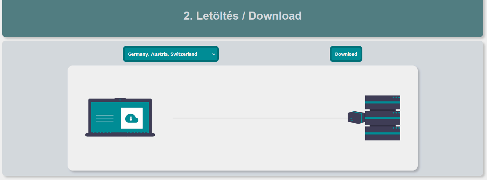

### 2. Letöltés (js-2-download, 14 pont)
A játékokat különböző régiókban található szerverekről tölthetjük le. Készíts egy vizualizációs programot, ami megmutatja egy-egy letöltött csomag útját!

- **a)** 1 pont: Az animációs ciklusban rajzold ki a szerver képét a `x:850, y:75` pontba, a kliens képét pedig az `x:50, y:90` pontba.
- **b)** 1 pont: Rajzolj egy `x:300->850, y:150` egyenes vonalat a szerver és a kliens közé. 
- **c)** 1 pont: Rajzold ki a csomag képét! A csomag mindig a letöltési adatok változóban található X koordinátán, és `y:130` pontban helyezkedik el. **A csomag 50 pixel széles, ez fejezi ki a csomag méretét. A további feladatoknál ezt figyelembe kell venni!**
- **d)** 2 pont: Ha megnyomjuk a download gombot, a csomag elindul a kliens felé 100 px/másodperc sebességgel.
- **e)** 1 pont: Ha a csomag egésze befejezte a letöltést, állítsd meg a csomagot.
    - *Csomag mérete*: a teljes csomagot le kell tölteni a kliensnek, tehát a letöltés akkor ér véget, ha a kép jobb oldala elhagyja a vonalat.
- **f)** 1 pont: Ha a csomag elér a klienshez és megáll, akkor írd ki, hogy `Download complete!` (`x:350, y:50, betűtípus: 30px Arial, szín: #008C95`). Segítség:
     ```JS
    context.font = '30px Arial';
    context.fillStyle = '#008C95';
     ```
- **g)** 2 pont: Ha megy a letöltés, rajzold ki a `select#region` mezőben kiválasztott kapcsolathoz tartozó akadályokat piros téglalapként a **csomag és a vonal mögé**. Az akadályokat a `data.js` fájlban találod. Minden akadály téglalapja függőlegesen `y: 75->225` közt található (150 pixel magas), vízszintesen pedig az adatai adják meg a helyzetét.
- **h)** 2 pont: Amikor a csomag épp egy akadályon halad keresztül, lassítsd le a sebességét 50 px/másodpercre.
    - *Csomag mérete*: a csomag addig van a veszélyzónában, amíg bármely vége érinti azt.
- **i)** 2 pont: A csomag a veszélyzónákban problémákba ütközhet. Ha a csomag veszélyzónában van, az update függvény minden hívásakor 1:1000 eséllyel történjen baj. Ekkor a letöltés leáll, és írd ki a `Download failed!` üzenetet (`x:350, y:50, betűtípus: 30px Arial, szín: #1D2530`).
    - 1:1000 esély = 0,1% esély. Például, ha 1-től 1000-ig gondolok egy számra, akkor 0,1% esély van rá, hogy az 1 az.
- **j)** 1 pont: A download gombot csak akkor lehessen megnyomni, ha épp nincs csomag úton a klienshez! (Tehát csak akkor lehet újat indítani, ha már vége a letöltésnek vagy hiba történt.)


